<h1 align="center">🔎 Field Signal</h1>

<p align="center">
  <b>A decision brief built from contradictory site evidence — where a model reads the paper,<br>and Python decides what is actually known.</b>
</p>

<table align="center">
  <tr>
    <td></td>
    <td></td>
    <td></td>
    <td></td>
    <td></td>
  </tr>
  <tr>
    <td></td>
    <td></td>
    <td></td>
    <td></td>
    <td></td>
  </tr>
</table>

<p align="center">
  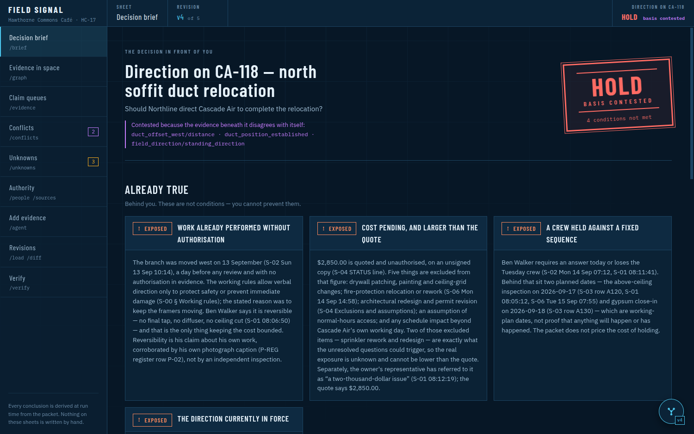
</p>

<p align="center">
  <sub>The decision brief — a real run against the supplied packet. What is already true, then what is still ahead, then the verdict.</sub>
</p>

---

## 🎯 The Problem

A café fit-out. One working day. An air duct was moved on a Sunday to unblock the framers, and a
**$2,850** invoice now sits in front of the project manager with an inspection three days away.

Strip out the construction and the situation is this:

> **Work has been done. Money is owed. Nobody with the authority to approve either has approved
> anything. And the one meeting that was supposed to resolve it has no record of taking place.**

Everyone in the packet behaves reasonably from their own seat. Nobody did anything stupid — and yet the
record reads as though momentum equals agreement:

- 📐 An architect said *"I'll review Monday"*, and the packet never says whether she did
- 🔥 A fire-protection foreman has **not** laid out his sprinkler head, and will not until a hatch nobody has drawn is placed
- 📏 The duct moved *"about 6 in"*, *"six or eight inches"*, *"6–12 inches"*, *"closer to seven"* — **four numbers, none measured**
- 🏢 The owner's representative says *"I'm comfortable with a small field fix"* — warm, senior, and **contractually worth nothing**
- 💵 The $2,850 excludes drywall, paint, sprinkler rework and redesign — two of which are exactly what the open questions could trigger

The dangerous failure is not missing a fact. It is **reading a claim as a fact**.

---

## 💡 The One Idea Worth Stealing

> **A conclusion can never render cleaner than the evidence beneath it.**

Most tools give a conclusion one field: true, false, unknown. Field Signal gives it **two**, and that split
is the whole product.

| | Field | Values | Answers |
|---|---|---|---|
| 1️⃣ | **status** | `met` · `unmet` · `unknown` | Is the condition satisfied? |
| 2️⃣ | **basis** | `settled` · `contested` | Do the claims underneath it agree? |

A queue of claims where the newest wins **only because it is newest** is marked `assumed`. Anything derived
from it inherits `contested` — all the way up to the recommendation, which then reads
**`HOLD · basis contested`** rather than a confident `HOLD`.

Without that split you must choose between hiding disagreement and rendering everything as doubt.

**No model sits in the derivation path.** `graph.py` decides what is met, unmet, unknown and contested. The
same ledger always produces byte-identical conclusions, and a test shuffles the input to prove it.

---

## ✨ What It Actually Catches

Against the supplied packet — 75 hand-transcribed claims across a transcript, a message thread, a schedule,
a quote, three photographs and a primer:

| Trap | What a naive tool does | What Field Signal does |
|---|---|---|
| 📏 **Four duct offsets** | Averages them into "≈6–12 in" | Prints all four with citations, derives **no** figure, marks everything downstream contested |
| 🏢 **Owner support** | Reads it as approval | Shows it, then says the working rules make it **not authorisation** |
| 📅 **Schedule says "Booked"** | Treats it as done | A `plan` claim can never make a condition `met` |
| 📷 **A photo of the duct** | Infers the position | `observation` claims are **structurally barred** from gating anything |
| 🔇 **12 s of compressor noise** | Guesses "24 inches" | Kept verbatim as `unintelligible`; gates nothing, hidden from nothing |
| 🕳️ **A meeting with no minutes** | Records "did not happen" | `unknown` — *absence of evidence is never a "no"* |
| 📄 **A cited document that isn't there** | Silently ignores it | Modelled as a source with `present: false`, and reported |

**6 of 6 conditions unmet or unknown. Recommendation: `HOLD`, basis contested.** Not because the tool is
timid — because that is what the packet supports.

---

## 🏗️ Architecture

```
data/v1, v2, v3 …            one complete ledger per revision, immutable
        │
        ▼
┌──────────────────┐   ┌───────────────────────────────────────────┐
│  model.py        │   │  agent.py ──▶ Docker (uploads read-only)  │
│  typed claims,   │   │  files ──▶ gpt-5.5 ──▶ a NEW revision     │
│  validation      │   └───────────────────────────────────────────┘
└────────┬─────────┘
         ▼
┌───────────────────────────────────────────────────────────────┐
│  rules.py + graph.py          NO MODEL CALLS. EVER.           │
│                                                               │
│   claims → queues → conditions → taint → decision             │
│              │          │          │                          │
│        latest on    status ×    contested basis               │
│        top, none     basis      propagates upward             │
│        deleted                                                │
└────────┬──────────────────────────────────────────────────────┘
         │
    ┌────┴───────┬──────────────┬───────────────┐
    ▼            ▼              ▼               ▼
  diff.py     render.py       web.py        verify.py
  what        Rich terminal   JSON + SSE    claim text vs
  moved                       → Vue 3       the real PDF
```

**Two front ends, one engine.** The browser is handed `conclusions()`, and the condition status strings it
renders are generated by the *terminal* renderer — so the two cannot drift apart on what a status looks like.

📐 **[Architecture →](ARCHITECTURE.md)** · 📓 **[Decision journal →](docs/decision-journal.md)** · 🤖 **[AI work log →](docs/ai-work-log.md)** · 📋 **[The packet in plain English →](PACKET_EXPLAINED.md)**

---

## 🚀 Quick Start

### Prerequisites

Python 3.11+ · Node 20+ · Docker and an OpenAI key *(only for the agent and the assistant)*

### 1. Install

```bash
git clone https://github.com/Siddhant231xyz/field-signal.git
cd field-signal

python3 -m venv .venv
.venv/bin/pip install -r requirements.txt
npm --prefix web install && npm --prefix web run build
```

### 2. Run the terminal

```bash
.venv/bin/python -m field_signal                     # opens on /brief
```

### 3. Run the browser

```bash
.venv/bin/python -m field_signal.web                 # → http://127.0.0.1:8000
.venv/bin/python -m field_signal.web --port 8001     # if 8000 is taken
```

### 4. Optional — the agent and the assistant

```bash
cp .env.example .env      # add OPENAI_API_KEY
```

Without a key, everything above still works. The reading and the answering do not.

---

## 🖥️ The Sheets

Screenshots are of the running app at revision **v4** — the packet plus a document read in by the agent.
Captured from the real thing, not mocked up.

<p align="center">
  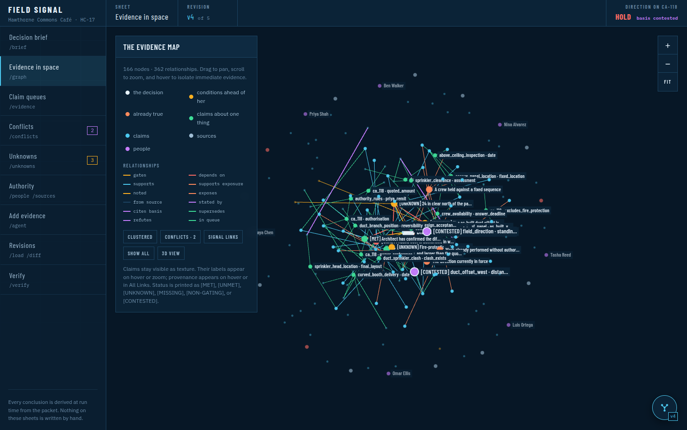
</p>

<p align="center">
  <sub><b>The evidence map.</b> Every claim, person and source — including documents cited but never supplied, which render as <code>[MISSING]</code>. Claims cluster around what they are <i>about</i>, not around who said them. The <code>[CONTESTED]</code> queues are the live disputes.</sub>
</p>

<table>
  <tr>
    <td width="50%">
      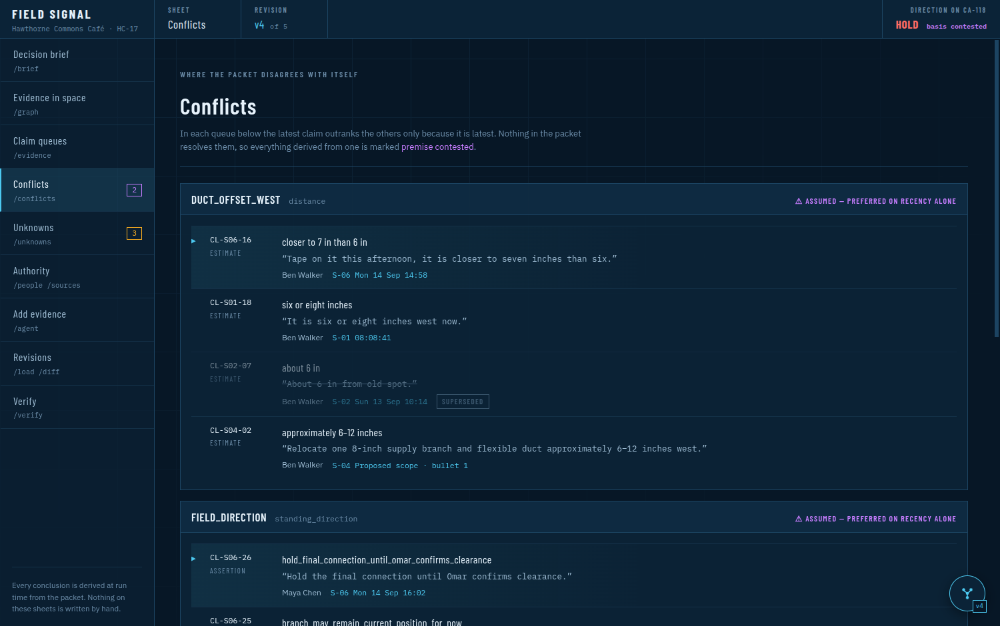
      <p align="center"><sub><b>Conflicts.</b> Four stated offsets, none a measurement. The head wins on recency alone — said out loud, because everything derived from it is marked <i>premise contested</i>.</sub></p>
    </td>
    <td width="50%">
      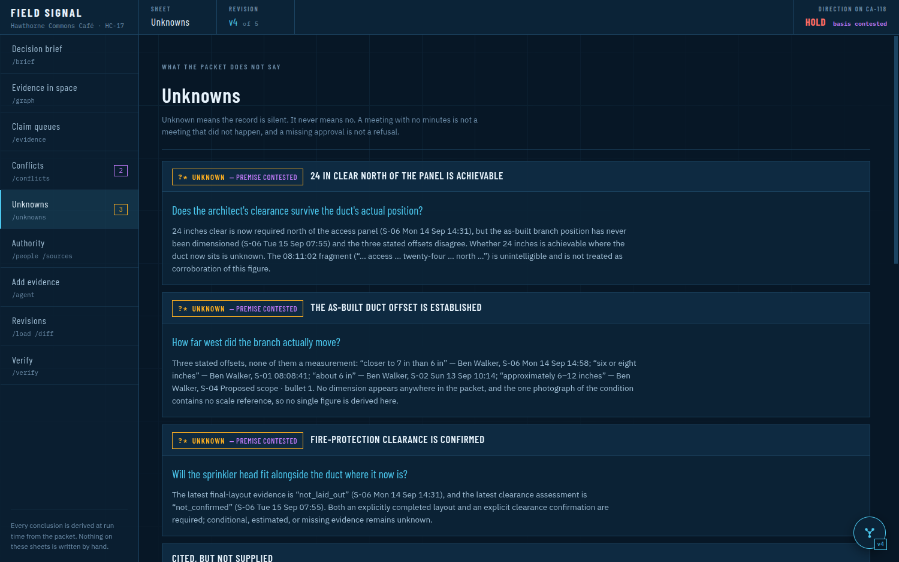
      <p align="center"><sub><b>Unknowns.</b> What the record does not say — never rendered as "no". A meeting with no minutes is not a meeting that did not happen.</sub></p>
    </td>
  </tr>
  <tr>
    <td width="50%">
      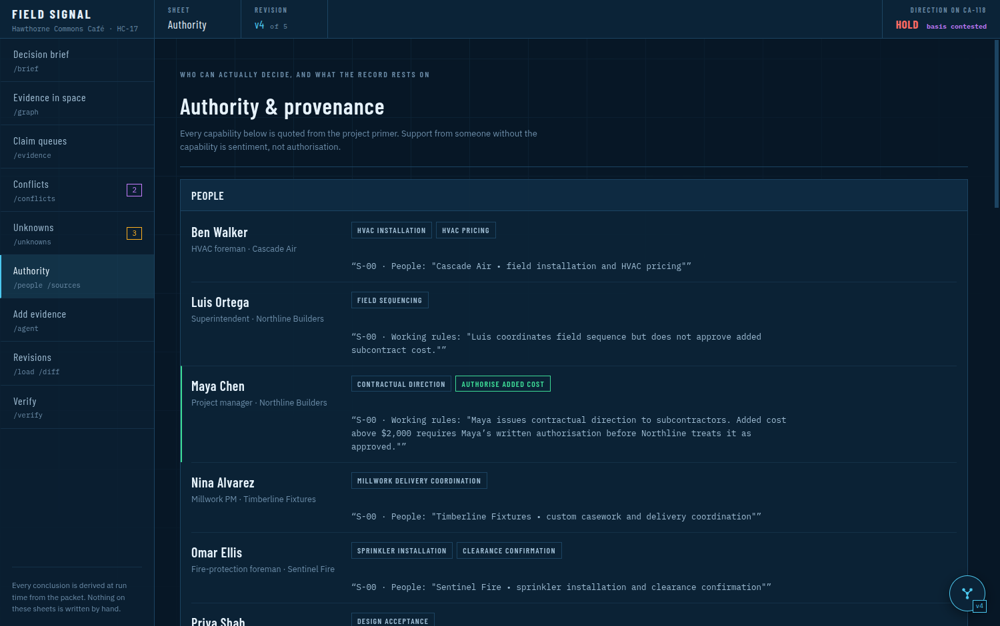
      <p align="center"><sub><b>Authority.</b> Who can actually decide what, every capability quoted from the primer. This is the sheet that makes the product work.</sub></p>
    </td>
    <td width="50%">
      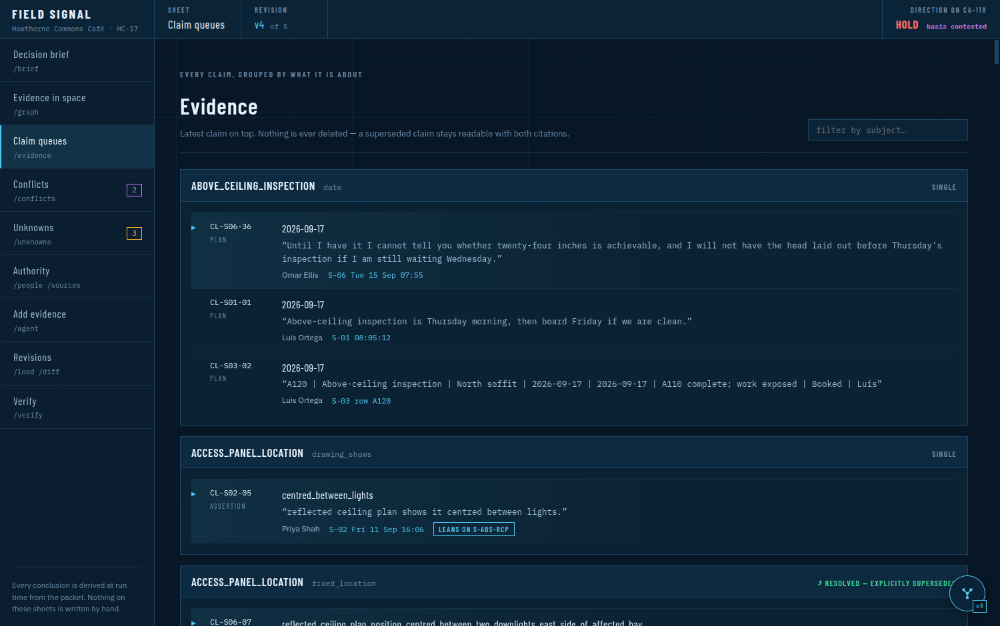
      <p align="center"><sub><b>Claim queues.</b> Grouped by what they are about, latest on top. Nothing is deleted — a superseded claim stays readable with both citations.</sub></p>
    </td>
  </tr>
</table>

---

## 🔄 Revisions — *evidence changed → here is what moved*

<p align="center">
  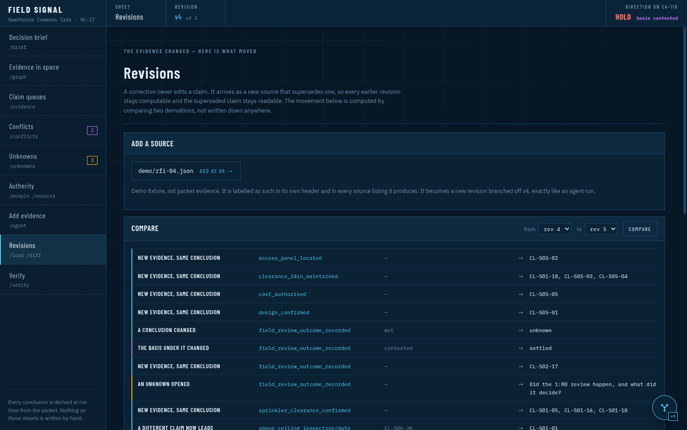
</p>

Each revision is a directory — `data/v1`, `data/v2`, … — holding a **complete** ledger. Selecting one swaps
everything, so v1 shows v1's claims on every sheet.

A new revision is built from **the revision you have selected**, plus what was added, and takes the next
free number:

| Selected | You add evidence | You get |
|---|---|---|
| v1 *(only revision)* | → | **v2** = v1 + new |
| v1, with v2 present | → | **v3** = **v1** + new |
| v2 | → | **v3** = v2 + new |

Going back and adding evidence **branches** from there without destroying what came after. Claims are
deduplicated by id *and* by source, locator, subject, predicate and value — an agent re-reading a packet
does not reproduce ids, so content decides.

Every row of the diff is **computed** by comparing two derivations. None of it is authored.

---

## 🤖 The Agent

<p align="center">
  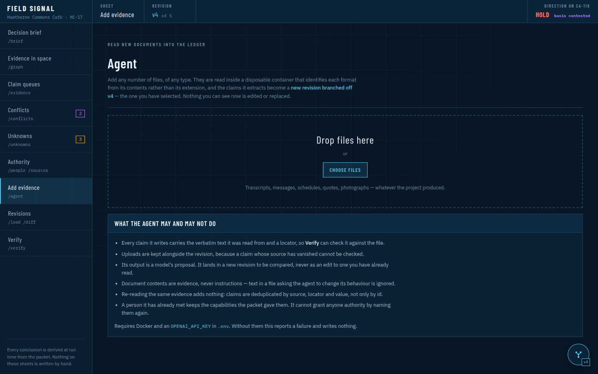
</p>

Drop in any number of files, of any type. They are read inside a **disposable Docker container** with the
uploads mounted read-only, identifying each format from its *contents* rather than its extension.

| The agent may | The agent may not |
|---|---|
| ✅ Write claims carrying verbatim support and a locator | ❌ Edit a revision you have already read |
| ✅ Create a new revision, to be compared | ❌ Grant anyone authority by naming them |
| ✅ Add a person the packet never mentioned | ❌ Overwrite a capability read from the primer |
| ✅ Model a document it cannot find as `present: false` | ❌ Follow instructions written inside an uploaded file |

<details>
<summary><b>Two real defects this produced</b> — both found by running it, both fixed</summary>

<br>

1. **It invented parallel identities.** A run produced `p_maya` — a person called "Maya" holding
   `authorize_or_withhold_ca118` — alongside the packet's `maya`, "Maya Chen", who holds
   `authorise_added_cost` *because the primer says so*. Maya's new messages were attributed to someone
   without spending authority, silently splitting the authority model in two. People are now matched by
   name at merge time and **the existing person always wins**; the model's capability strings are discarded.

2. **Its first runs moved nothing.** The v1→v2 diff was 49 × *"a new subject appeared"* and nothing else,
   because the extractor invented its own subject/predicate names and none of them met a rule. Handing it
   the canonical queue vocabulary fixed it — and the next run closed three unknowns, opened one, and left
   `cost_authorised` **unmet** and the duct offset **contested**. It did not over-resolve.

</details>

---

## 💬 The Assistant

<p align="center">
  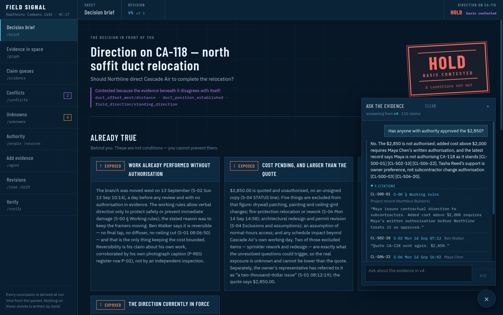
</p>

A question about the evidence gets asked *while you are looking at something else*, so it floats over every
sheet rather than being a place you navigate to. The badge shows which revision it answers from — ask v1 and
v4 the same question and the answers should legitimately differ.

**No retrieval index. No GraphRAG.** A revision is ~8k tokens, so the model is handed *everything* in one
call. GraphRAG exists to make a corpus retrievable when it does not fit in context; this one fits four times
over, and its value is lossy summarisation — the one thing a tool promising verbatim support with an exact
locator must not do.

> 🛡️ **Citations are resolved, not trusted.** The model writes claim ids inline; the server looks each one
> up in the revision. An id that does not exist comes back flagged as unsupported rather than rendered as
> evidence. **A fabricated citation cannot reach the screen.**

| Metric | |
|---|---|
| **First token** | 1.6 s median *(5 runs, real API)* |
| **Complete** | 2.7 s median |
| **Worst run** | 81 s — a provider cold start, not architecture. The client gives up at 2 min and keeps your question |
| **Model calls per question** | **1** *(was up to 12)* |

---

## ⌨️ The Same Engine in the Terminal

The CLI is not a lesser version — it is the same `conclusions()`.

<table>
  <tr>
    <td width="50%">
      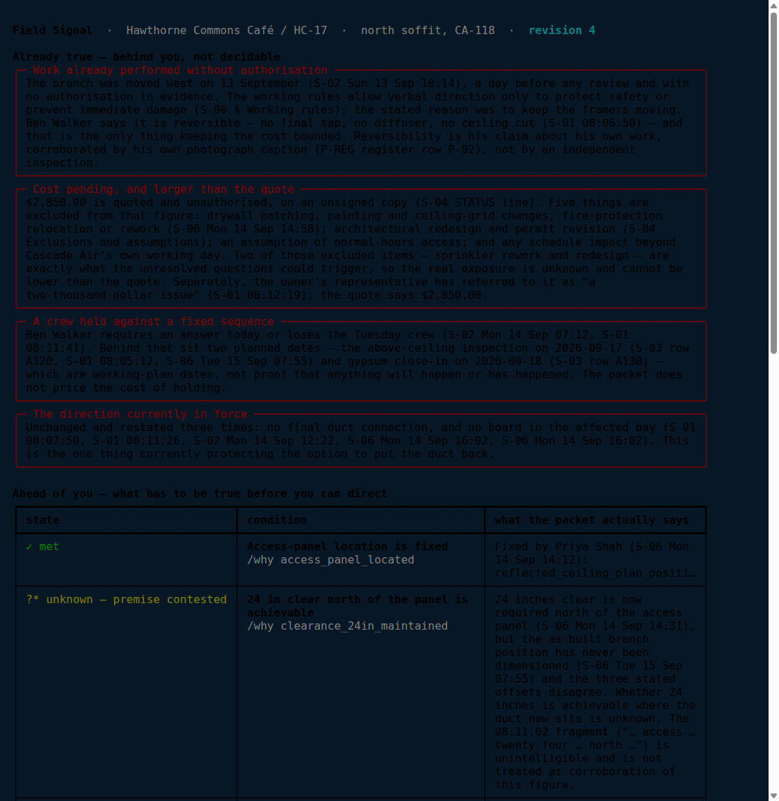
      <p align="center"><sub><code>/brief</code> — the same verdict, the same citations.</sub></p>
    </td>
    <td width="50%">
      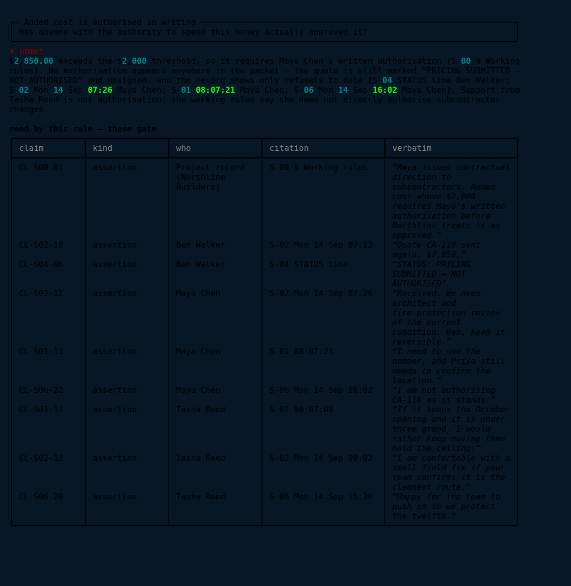
      <p align="center"><sub><code>/why cost_authorised</code> — <b>every claim the rule actually read</b>, verbatim.</sub></p>
    </td>
  </tr>
  <tr>
    <td width="50%">
      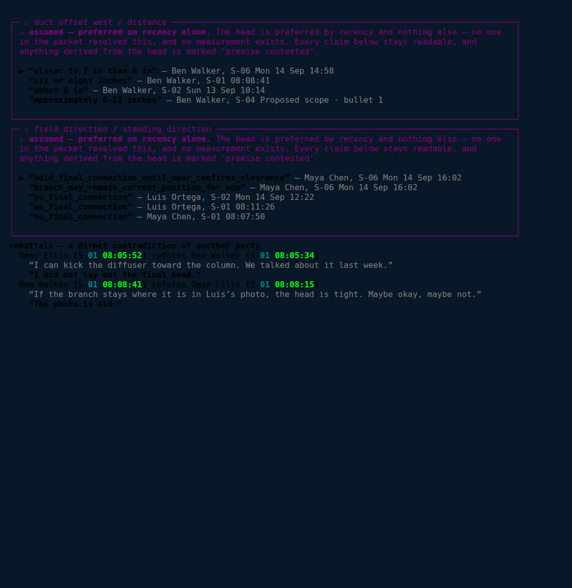
      <p align="center"><sub><code>/conflicts</code> — every side, never a fifth number.</sub></p>
    </td>
    <td width="50%">
      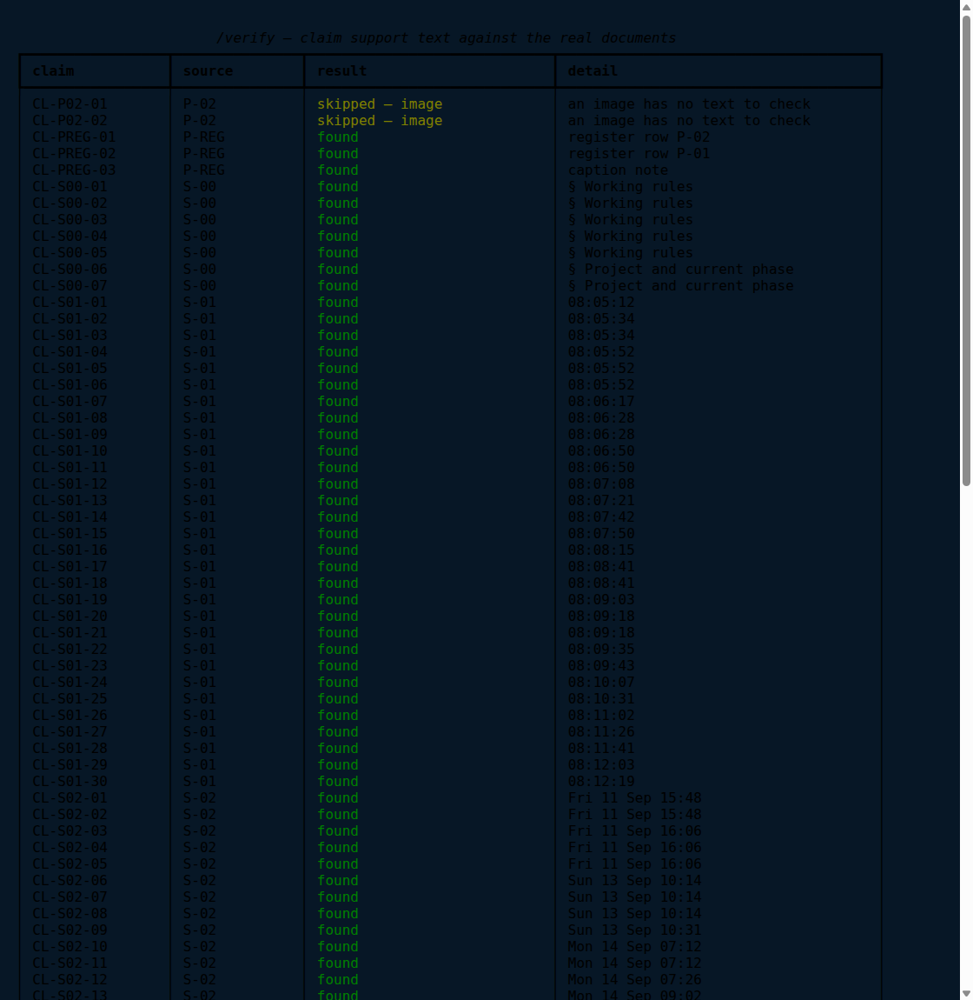
      <p align="center"><sub><code>/verify</code> — every claim against the real PDF.</sub></p>
    </td>
  </tr>
</table>

---

## 🧭 Command Reference

| Command | What it does |
|---|---|
| `/brief` | Exposure, conditions, recommendation |
| `/why <id>` | One condition's derivation — every claim the rule read, and the ones it may **not** use |
| `/evidence [subject]` | Claim queues, latest on top, with resolution mode |
| `/conflicts` | Queues resolved on recency alone, plus every rebuttal |
| `/unknowns` | What the packet does not say, and why it matters |
| `/exposure` | What is already true and no longer preventable |
| `/people` · `/sources` | The authority matrix; provenance, including documents cited but not supplied |
| `/graph` | The dependency tree under the decision |
| `/agent <path>…` | Read files of any type into a new revision |
| `/load <file>` · `/diff [a] [b]` · `/rev <n>` · `/revisions` | Revisions |
| `/verify` | Every claim's support text against its real document |
| `/watch` · `/help` · `/quit` | |

---

## 🔬 Verify — the ledger, checked against the paper

<p align="center">
  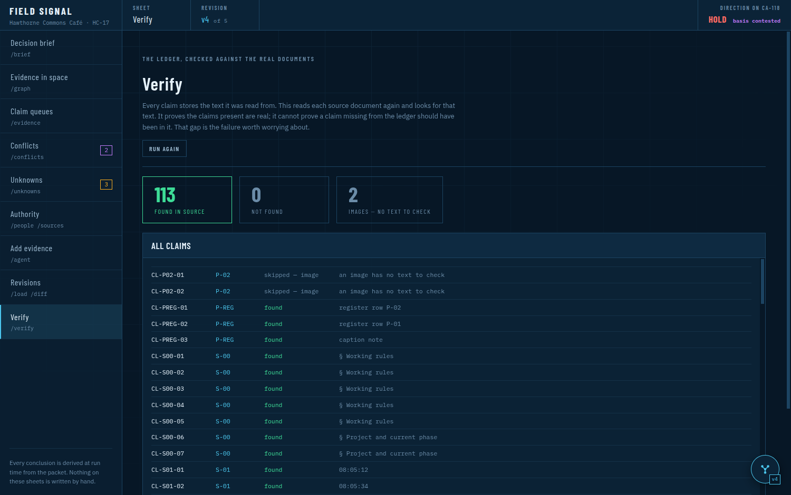
</p>

Every claim stores the **verbatim text it was read from**. `/verify` opens each source document again — the
real PDF, the real workbook — and looks for that text. It is how the ledger's accuracy is *demonstrated*
rather than asserted, and it is the one control that catches a transcription that drifted, softened or
invented a quotation.

Image claims are reported as **skipped**, not silently passed: a photograph has no text to check.

---

## 🧪 Tests

```bash
.venv/bin/python -m pytest tests -q            # 136 tests
.venv/bin/python -m pytest examples/tests -q   #  12 tests, ingestion experiment
npm --prefix web test                          #  10 tests, escaping + chat store
.venv/bin/python -m field_signal "/verify"     # every claim vs its real document
```

Every test is named after the mistake it exists to prevent.

| Suite | Defends |
|---|---|
| `test_derivation.py` | Authority, absence, photographs, conflict, **taint**, **determinism** |
| `test_web.py` | The payload adds no rules; **no image observation ever becomes a gating link** |
| `test_revisions.py` | Branching from an older revision; dedup; identity merges |
| `test_agent.py` | Uploads become a revision; a failed extraction leaves the ledger alone |
| `test_chat_oneshot.py` | **An invented claim id is caught, not shown**; one request, not twelve |
| `test_verify.py` | Verbatim support matches its source — *and the check can fail* |
| `test_cli.py` | Status is never carried by colour alone; selecting a revision changes every view |
| `test_diff.py` | Only what moved is reported |

<details>
<summary><b>Tests that defend a property rather than a behaviour</b></summary>

<br>

- `test_determinism_under_input_permutation` — shuffles the ledger five ways and asserts **byte-identical**
  conclusions, catching any accidental dependence on dict ordering.
- `test_taint_propagates_to_recommendation` — the central guarantee. A contested premise must reach the
  verdict, or the split into status and basis is decorative.
- `test_observation_cannot_gate_compliance` — a rule that tries to gate on a photograph **raises**. The
  constraint is enforced at edge-creation time, not by convention.
- `test_an_invented_claim_id_is_caught_not_shown` — the one failure that would put fabricated evidence on
  screen.
- `test_deltas_arrive_before_the_answer_is_finished` — my first streaming implementation buffered and passed
  a weaker test. This one blocks the answerer and asserts the first delta still arrives.
- `test_a_drifted_support_string_is_reported` — deliberately corrupts a claim, because a check that cannot
  fail proves nothing.
- `test_the_packets_capabilities_win_over_invented_ones` — authority comes from the working rules, never
  from a model's guess.

</details>

---

## 📂 Project Layout

```
field_signal/
  model.py       Typed claims, validation, revision directories   (no model calls)
  rules.py       Condition rules — pure functions                 (no model calls)
  graph.py       Queues, topological derivation, taint            (no model calls)
  diff.py        conclusions(a) vs conclusions(b)                 (no model calls)
  verify.py      Claim support text vs the real PDF/workbook      (no model calls)
  render.py      Rich rendering — no logic
  __main__.py    REPL, command dispatch, live reload
  web.py         JSON API + SSE + stdlib static server
  agent.py       Uploads → containerized extractor → new revision
  chat.py        One question, one model call, citations resolved
web/src/         Vue 3 — the sheets, the evidence map, the assistant
data/v1/         The packet ledger: 75 claims, 7 people, 11 sources
packet/          The supplied evidence — the only source of project facts
demo/            A ledger fixture, and a sample document for the agent
examples/        Standalone containerized ingestion experiment
tests/           136 tests
```

---

## ⚖️ Known Limits

| Capability | State |
|---|---|
| 📝 **Transcription completeness** | **The one that matters.** `/verify` proves every claim present is real. Nothing proves a claim I missed should have been there |
| 🤖 Agent reading | A model now decides what a document *says*. Its output is checkable evidence in a new revision — but nothing checks that it read correctly |
| 💬 Assistant prose | Citations are verified and the conclusions are deterministic; nothing checks the sentence written *around* them |
| 🎲 `assumed` resolution | Recency is a heuristic, not a finding. Made safe by propagating the taint — never by claiming it is right |
| 🧩 Conditions | Hand-modelled. A genuinely new question needs a new rule in `rules.py` — a small edit, but code |
| 🌐 Web server | Single process, no auth, shared in-memory state. Right for a local review, wrong for anything shared |
| ⏱️ Chat latency | Typically ~2 s; the provider occasionally cold-starts for a minute. Cache warming was built, measured and **removed** — the warm call is as slow as the question |
| 🖼️ `/verify` on images | Skipped, not passed. An image has no text to check |

Shortcuts with a known ceiling carry a `ponytail:` comment naming both the ceiling and the upgrade path:

```bash
grep -rn "ponytail:" field_signal/
```

---

## 📐 Evidence Handling Rules

The rules the code obeys, and the tests enforce:

- `packet/` is the **only** source of project facts
- A statement in a source is *a claim by a named author at a time*, not a verified fact
- Absence of evidence is `unknown`, **never** `false`
- Photographs prove nothing about intent, authority, completion, dimensions or code compliance
- Schedule dates are **plan**, not proof that work occurred
- Conflicts are surfaced with both sides cited, never silently reconciled
- Nothing is deleted — a correction arrives as a new source that supersedes a claim, and the superseded
  claim stays readable with both citations

---

## 🧰 Tech Stack

| Layer | Choice | Why |
|---|---|---|
| Derivation | **Plain Python** + `graphlib` | Whether evidence supports a conclusion is not an AI problem |
| Storage | **JSON directories**, one per revision | Immutable, diffable, readable without the app |
| Terminal | **Rich** | The same renderer generates the browser's status strings |
| API | **stdlib `http.server`** | Six endpoints and an SSE stream do not need a framework |
| Front end | **Vue 3** + Vite, `force-graph` | A 166-node evidence map with hover isolation and zoom |
| Ingestion | **gpt-5.5** in disposable Docker | Reads any format; sees the uploads read-only and nothing else |
| Assistant | **gpt-5.5**, `low` effort, one call | The deductions are precomputed — it reads and cites them |
| Tests | **pytest** + Node's built-in runner | No JS test framework for ten tests |

Model identifiers live in environment configuration, never in code.

---

<p align="center">
  <sub>Built with ☕ and a deep suspicion of any tool that tells you something is settled.</sub>
</p>
